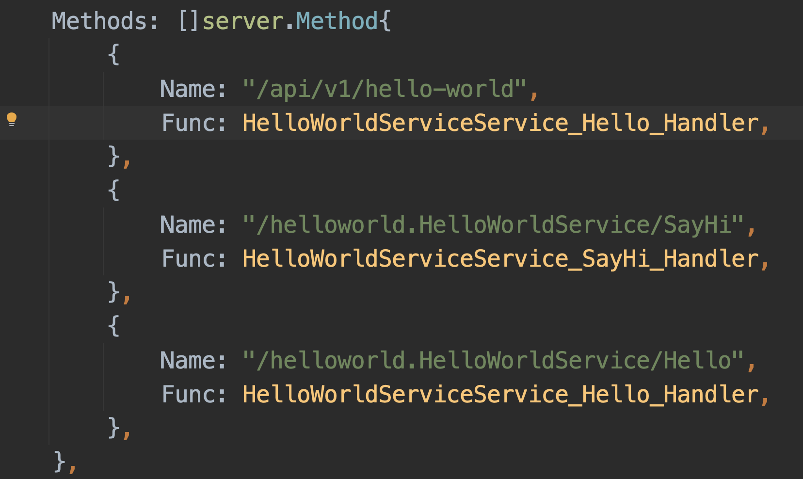

# README

## go mod init

`go mod init github.com/1005281342/trpc-demo`

## 环境安装

安装 [官方命令行工具](https://github.com/trpc-group/trpc-cmdline/blob/main/README.zh_CN.md) 文档

通过 `go install trpc.group/trpc-go/trpc-cmdline/trpc@latest` 安装 `trpc` 命令行工具

[使用 trpc setup 一键安装所有依赖](https://github.com/trpc-group/trpc-cmdline/blob/main/README.zh_CN.md#%E4%BD%BF%E7%94%A8-trpc-setup-%E4%B8%80%E9%94%AE%E5%AE%89%E8%A3%85%E6%89%80%E6%9C%89%E4%BE%9D%E8%B5%96) 
可能会因为一些网络问题导致设置失败，可以通过如下方式手动配置
- 下载官方提供的二进制文件，如 macOS 系统的 https://github.com/trpc-group/trpc-cmdline/releases/tag/v0.0.1-darwin
- 添加可执行权限 `chmod +x 工具二进制文件`
- 将这些工具拷贝到 `go/bin` 目录下，并通过 `which 工具二进制文件` 确定这些工具可以被找到

## 开始编写一个 tRPC 服务

### 协议设计

参考官方提供的示例协议 https://github.com/trpc-group/trpc-cmdline/blob/main/docs/helloworld/helloworld.proto

创建 `helloworld.proto` 文件并添加如下协议内容

```protobuf
syntax = "proto3";
package helloworld;

option go_package = "github.com/1005281342/trpc-demo/helloworld";

// HelloRequest is hello request.
message HelloRequest {
    string msg = 1;
}

// HelloResponse is hello response.
message HelloResponse {
    string msg = 1;
}

// HelloWorldService handles hello request and echo message.
service HelloWorldService {
    // Hello says hello.
    rpc Hello(HelloRequest) returns(HelloResponse);
}
```

### 生成项目 

`trpc create -p helloworld.proto -o .`

### 启动服务

`go run .`

```
2023-10-21 15:52:32.359 DEBUG   maxprocs/maxprocs.go:47 maxprocs: Leaving GOMAXPROCS=12: CPU quota undefined
2023-10-21 15:52:32.360 INFO    server/service.go:167   process:8575, trpc service:helloworld.HelloWorldService launch success, tcp:127.0.0.1:8000, serving ...
```

### 发起请求

`go run cmd/client/main.go`

客户端日志
```
2023-10-21 15:54:57.034 DEBUG   debuglog@v1.0.0/log.go:236      client request:/helloworld.HelloWorldService/Hello, cost:1.880357ms, to:127.0.0.1:8000
2023-10-21 15:54:57.034 DEBUG   client/main.go:25       simple  rpc   receive: 
```

服务端日志
```
2023-10-21 15:54:57.033 DEBUG   debuglog@v1.0.0/log.go:196      server request:/helloworld.HelloWorldService/Hello, cost:9.418µs, from:127.0.0.1:60328
```

## 业务编码

### 修改 Hello 接口

- 响应用户输入的 msg

    ```go
    // Hello Hello says hello.
    func (s *helloWorldServiceImpl) Hello(
        ctx context.Context,
        req *pb.HelloRequest,
    ) (*pb.HelloResponse, error) {
        rsp := &pb.HelloResponse{
            Msg: req.GetMsg(),
        }
        return rsp, nil
    }
    ```

- 重启服务

- 修改客户端 `cmd/client/main.go` 中 `callHelloWorldServiceHello()` 的请求内容
  
    ```go
    // Example usage of unary client.
    reply, err := proxy.Hello(ctx, &pb.HelloRequest{
        Msg: "hello tRPC",
    })
    ```
- 发送请求进行测试

    客户端日志
    ```
    2023-10-21 16:13:10.556 DEBUG   debuglog@v1.0.0/log.go:236      client request:/helloworld.HelloWorldService/Hello, cost:2.020233ms, to:127.0.0.1:8000
    2023-10-21 16:13:10.556 DEBUG   client/main.go:27       simple  rpc   receive: msg:"hello tRPC"
    ```

    服务端日志
    ```
    2023-10-21 16:13:10.556 DEBUG   debuglog@v1.0.0/log.go:196      server request:/helloworld.HelloWorldService/Hello, cost:9.456µs, from:127.0.0.1:63248
    ```


### 新增 SayHi 功能

- 接口协议

  ```protobuf
  ...
  
  // SayHiReq is says hi request
  message SayHiReq {}
  
  // SayHiRsp is says hi response
  message SayHiRsp {
      string msg = 1;
  }
  
  // HelloWorldService handles hello request and echo message.
  service HelloWorldService {
      ...
  
      // SayHi says hi
      rpc SayHi(SayHiReq) returns (SayHiRsp);
  }
  ```
  
- 更新桩代码 `trpc create -p helloworld.proto -o ./stub/github.com/1005281342/trpc-demo/helloworld --rpconly`

- 实现 SayHi 接口

  ```go
  func (s *helloWorldServiceImpl) SayHi(ctx context.Context, req *pb.SayHiReq) (*pb.SayHiRsp, error) {
      return &pb.SayHiRsp{Msg: "hi"}, nil
  }
  ```

- 启动服务 `go mod tidy && go run .`

- 添加测试代码

  ```go
  func main() {
      // Load configuration following the logic in trpc.NewServer.
      cfg, err := trpc.LoadConfig(trpc.ServerConfigPath)
      if err != nil {
          panic("load config fail: " + err.Error())
      }
      trpc.SetGlobalConfig(cfg)
      if err := trpc.Setup(cfg); err != nil {
          panic("setup plugin fail: " + err.Error())
      }
      //callHelloWorldServiceHello()
      callHelloWorldServiceSayHi()
  }
  
  func callHelloWorldServiceSayHi() {
      proxy := pb.NewHelloWorldServiceClientProxy(
          client.WithTarget("ip://127.0.0.1:8000"),
          client.WithProtocol("trpc"),
      )
      ctx := trpc.BackgroundContext()
      // Example usage of unary client.
      reply, err := proxy.SayHi(ctx, &pb.SayHiReq{})
      if err != nil {
          log.Fatalf("err: %v", err)
      }
      log.Debugf("[SayHi] -- simple  rpc   receive: %+v", reply)
  }
  ```
  
- 发送请求进行测试 `go run cmd/client/main.go`

  客户端日志
  ```
  2023-10-21 16:47:08.698 DEBUG   debuglog@v1.0.0/log.go:236      client request:/helloworld.HelloWorldService/SayHi, cost:2.969017ms, to:127.0.0.1:8000
  2023-10-21 16:47:08.698 DEBUG   client/main.go:39       [SayHi] -- simple  rpc   receive: msg:"hi"
  ```
  
  服务端日志
  ```
  2023-10-21 16:47:08.697 DEBUG   debuglog@v1.0.0/log.go:196      server request:/helloworld.HelloWorldService/SayHi, cost:3.751µs, from:127.0.0.1:52401
  ```
  
## 配置 HTTP 服务

参考 [泛 HTTP RPC 服务](https://github.com/trpc-group/trpc-go/blob/main/http/README.zh_CN.md#%E6%B3%9B-http-rpc-%E6%9C%8D%E5%8A%A1)

### 在 `trpc_go.yaml` 注册 HTTP 服务配置

可以直接从原来自动生成的 tRPC `helloworld.HelloWorldService` 服务配置复制修改

- 修改服务名字，可以添加后缀 `HTTP` 得到 http 服务名字 `helloworld.HelloWorldServiceHTTP`
- 修改协议，protocol 设置为 http
- 修改端口，使用一个未被占用的端口

```yaml
  service:  # Services provided by the business, can have multiple.
    - name: helloworld.HelloWorldService  # Route name for the service.
      ip: 127.0.0.1  # Service listening IP address, can use placeholder ${ip}. Use either ip or nic, ip takes priority.
      # nic: eth0
      port: 8000  # Service listening port, can use placeholder ${port}.
      network: tcp  # Network listening type: tcp or udp.
      protocol: trpc  # Application layer protocol: trpc or http.
      timeout: 1000  # Maximum processing time for requests in milliseconds.
    - name: helloworld.HelloWorldServiceHTTP  # Route name for the service.
      ip: 127.0.0.1  # Service listening IP address, can use placeholder ${ip}. Use either ip or nic, ip takes priority.
      # nic: eth0
      port: 8001  # Service listening port, can use placeholder ${port}.
      network: tcp  # Network listening type: tcp or udp.
      protocol: http  # Application layer protocol: trpc or http.
      timeout: 1000  # Maximum processing time for requests in milliseconds. 
```

### 在 `main.go` 注册 HTTP 服务
```go
func main() {
	s := trpc.NewServer()
	pb.RegisterHelloWorldServiceService(s.Service("helloworld.HelloWorldService"), 
		&helloWorldServiceImpl{})
	pb.RegisterHelloWorldServiceService(s.Service("helloworld.HelloWorldServiceHTTP"), 
		&helloWorldServiceImpl{})
	if err := s.Serve(); err != nil {
		log.Fatal(err)
	}
}
```

### 测试

- 启动服务

  ```
  2023-10-21 17:00:32.627 DEBUG   maxprocs/maxprocs.go:47 maxprocs: Leaving GOMAXPROCS=12: CPU quota undefined
  2023-10-21 17:00:32.628 INFO    server/service.go:167   process:16524, http service:helloworld.HelloWorldServiceHTTP launch success, tcp:127.0.0.1:8001, serving ...
  2023-10-21 17:00:32.628 INFO    server/service.go:167   process:16524, trpc service:helloworld.HelloWorldService launch success, tcp:127.0.0.1:8000, serving ...
  ```

- 测试服务
  
  请求  

  ```http request
  POST http://127.0.0.1:8001/helloworld.HelloWorldService/Hello
  Content-Type: application/json
  
  {
    "msg": "123"
  }
  ```
  
  响应

  ```
  POST http://127.0.0.1:8001/helloworld.HelloWorldService/Hello
  
  HTTP/1.1 200 OK
  Content-Type: application/json
  X-Content-Type-Options: nosniff
  Date: Sat, 21 Oct 2023 09:07:01 GMT
  Content-Length: 13
  
  {
    "msg": "123"
  }
  Response file saved.
  > 2023-10-21T170701.200.json
  ```
  
## 自定义接口别名

[官方示例文档](https://github.com/trpc-group/trpc-cmdline/blob/main/docs/examples/example-2/README.zh_CN.md#%E8%87%AA%E5%AE%9A%E4%B9%89%E6%8E%A5%E5%8F%A3%E5%88%AB%E5%90%8D) 中介绍了两种自定义接口方式

使用 `trpc.alias`，需要 import "trpc/proto/trpc_options.proto"; 

然后通过 `rpc Hello(HelloRequest) returns(HelloResponse) { option(trpc.alias) = "/api/v1/hello-world"; };` 设置接口别名

使用命令 `trpc create -p helloworld.proto -o ./stub/github.com/1005281342/trpc-demo/helloworld --rpconly` 重新生成桩代码



重启服务并测试

```
POST http://127.0.0.1:8001/api/v1/hello-world

HTTP/1.1 200 OK
Content-Type: application/json
X-Content-Type-Options: nosniff
Date: Sat, 21 Oct 2023 16:25:01 GMT
Content-Length: 13

{
  "msg": "123"
}
Response file saved.
> 2023-10-22T002501.200.json
```

### 生成桩代码可能会遇到的问题

#### google/protobuf/xxx.proto 找不到

错误提示大致如下：

```
stub/github.com/1005281342/trpc-demo/helloworld helloworld.proto`, error: google/protobuf/descriptor.proto: File not found.
trpc/proto/trpc_options.proto:3:1: Import "google/protobuf/descriptor.proto" was not found or had errors.
trpc/proto/trpc_options.proto:10:8: "google.protobuf.MethodOptions" is not defined.
trpc/proto/trpc_options.proto:14:8: "google.protobuf.FieldOptions" is not defined.
helloworld.proto:4:1: Import "trpc/proto/trpc_options.proto" was not found or had errors.
```

解决方案：

```
参考：https://github.com/grpc-ecosystem/grpc-gateway/issues/422
通过在 goland 中配置 protocol 目录手动修复

In addition to copy protoc/include/google into /usr/local/include/.

For Goland (or other Jetbrains IDE), need do following:

preference -> language & framework -> protocol buffers,
uncheck "configure automatically",
add import path as /usr/local/include.
```

